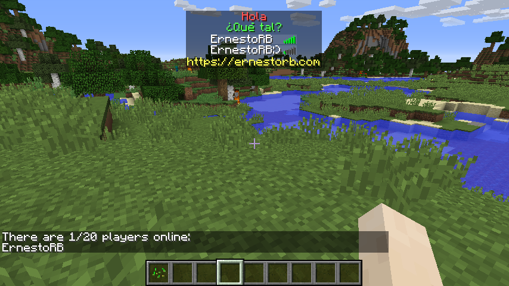

This plugin is just an example on how to use [TablistManagerAPI](https://github.com/ErnestoRB/TablistManagerAPI). It shows a FakePlayer on tablist when a player joins, its name is the same as the player who entered the game plus ":)"

